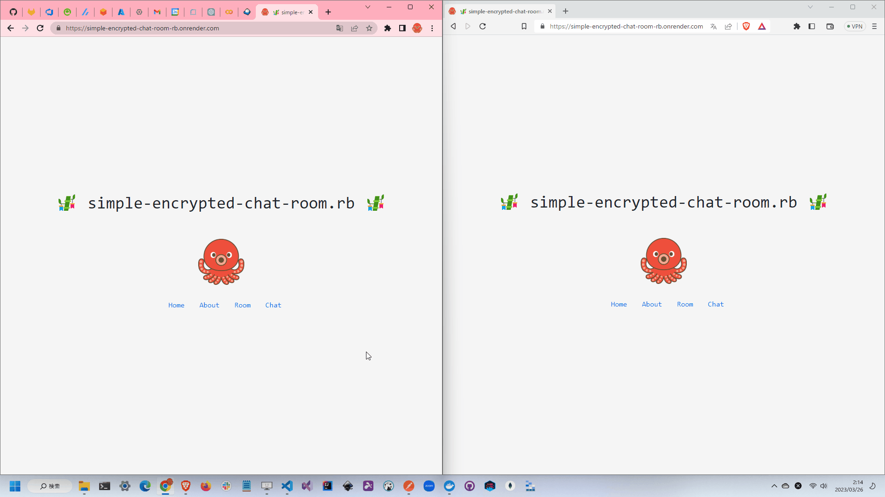

# simple-encrypted-chat-room.rb

🍉🍉🍉 暗号化してチャットできるアプリです。  
ルーム機能とチャット機能を実装しています。  

  

## 実行方法

```shell
docker build -t simple-encrypted-chat-room-rb .
docker run --rm -it -p 8000:8000 --name simple-encrypted-chat-room-rb simple-encrypted-chat-room-rb
```

## 使用している技術

- Next.js
  - React
  - TypeScript
  - Bootstrap
- Ruby
  - Ruby on Rails
  - API mode
  - Action Cable (WebSocket)
- Docker
- GitHub
  - Repository
  - GitHub Actions

## 説明

> **Warning**  
> お遊び(学習)目的で作成したものです。  
> 実際に作成することを目的としていません。  

RC4で暗号化した文字列をWebSocketで送信しています。  
これは同一のキーを持ったユーザのみが復号できるため、ルームそのものにパスワードをかけることなく機密性を実現します。  

実際にはRC4は脆弱性があるため、簡単に復号できてしまいます、、、  
